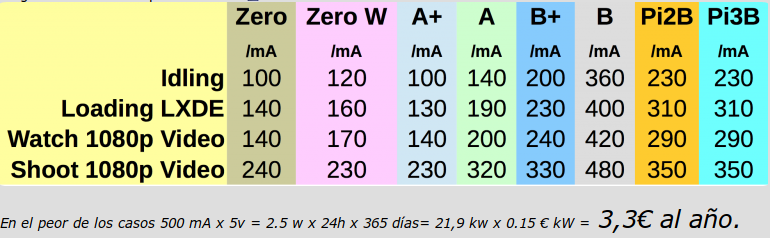
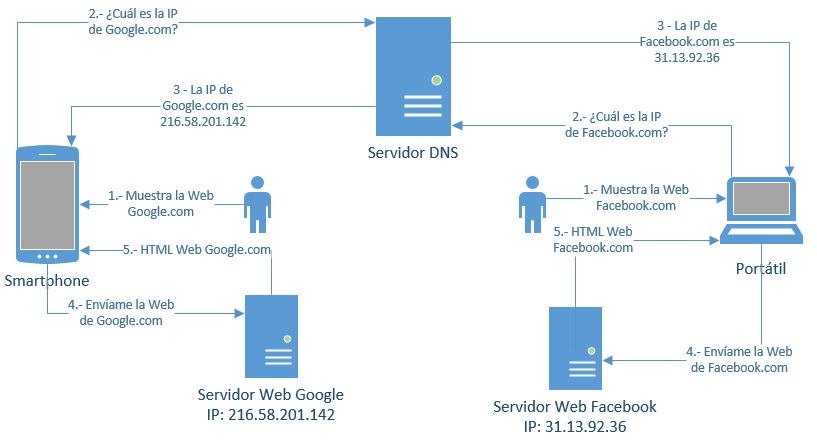

# Pi-Hole
Adiós a la publicidad

# Contenidos
- Raspberry Pi
- Otras opciones
- Pi-Hole
- VPN
Note: 
- Raspberry Pi: Qué es, Sistema operativo, consumo, donde comprarlo, para qué sirve
- Otras opciones: 
- Pi-Hole: Funcionamiento, dns, instalación, personalización, actualización, configuración clientes
- VPN

	

## [¿Qué es?](https://es.wikipedia.org/wiki/Raspberry_Pi)  

## [Raspbian](https://www.raspberrypi.org/downloads/raspbian/) 
Sistema operativo

## Consumo

## [Precio](https://www.kubii.es/40-raspberry-pi-3-2-b) 

## ¿Para qué sirve?
- Domótica
- Videojuegos
- Servidores caseros
- Control de redes
- ....

# Otras opciones
- [Contenedor Docker](https://hub.docker.com/r/pihole/pihole/)
- Máquina virtual
	- [Descarga](https://www.osboxes.org/raspbian/) 
	- [DIY](https://www.luisllamas.es/raspberry-pi-virtualbox/)
- Equipo antiguo
- [Alternativas a Raspberry Pi](https://tecnobits.xyz/mejores-alternativas-a-la-raspberry-pi-en-2018/) 

# [Pi-Hole](https://pi-hole.net/) 

## ¿Qué es Pi-Hole?
- dnsmasq: Un servidor ligero de DNS y DHCP.
- curl: Una herramienta de linea de comando para la gestión de peticiones HTTP.
- lighttpd: Un servidor web focalizado en el desempeño y la seguridad.
- php: Lenguaje de scripting de uso general para la web.
- AdminLTE Dashboard: Panel de control basado en Bootstrap 3.x

## Funcionamiento DNS
